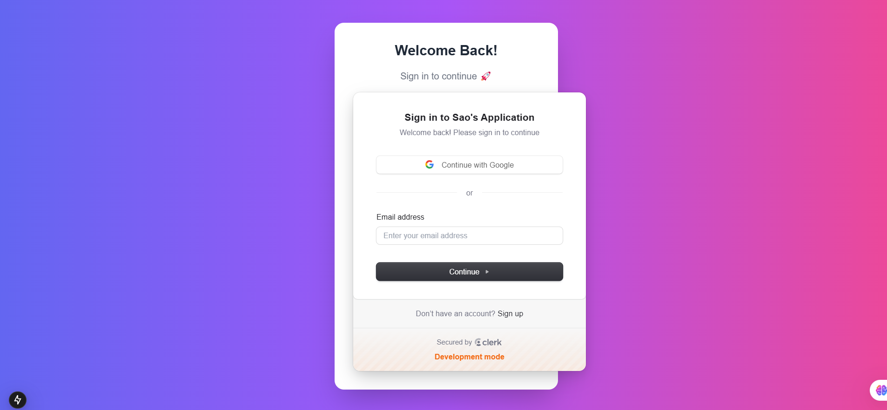
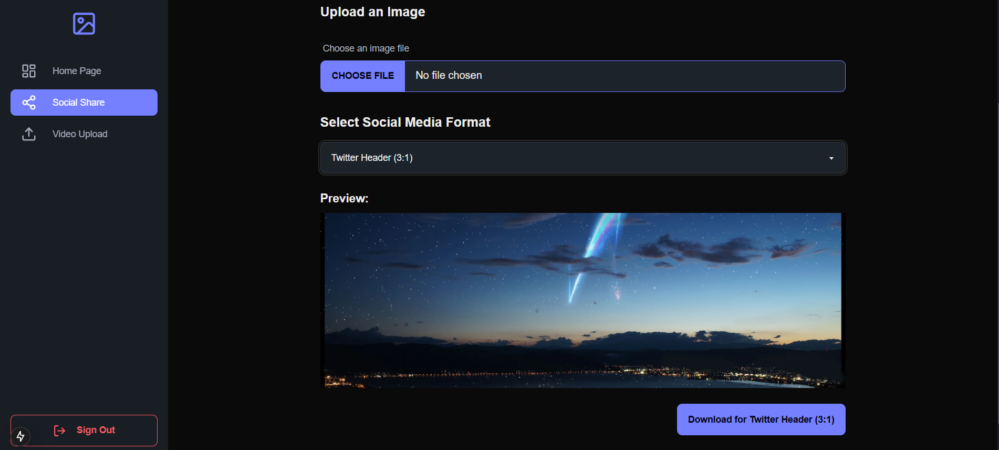
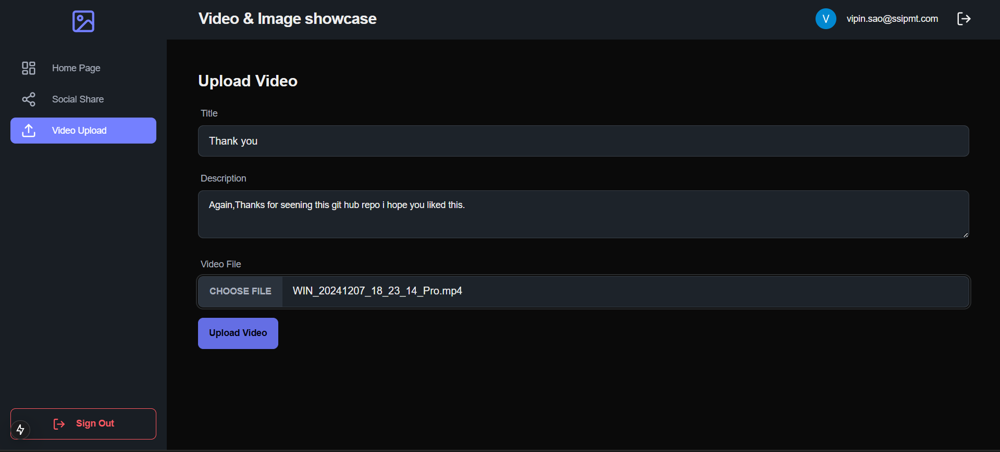
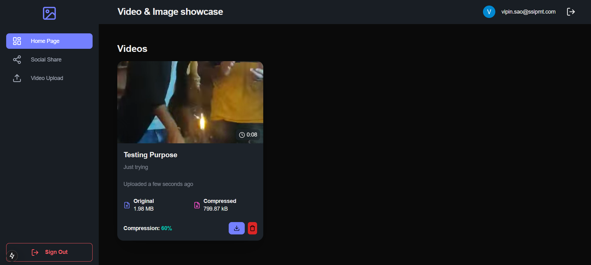

# AI-Driven SaaS Web Application


## 🚀 Overview
This advanced AI-driven Software-as-a-Service (SaaS) platform provides an innovative approach to video processing, integrating seamless **upload capabilities, sophisticated analytical tools, and automated AI-driven insights**. Engineered to support enterprises and developers, this system abstracts the complexities of video-based artificial intelligence workflows while ensuring high performance, security, and scalability.

## ✨ Key Features
- 📂 **Effortless Video Ingestion** – Streamlined drag-and-drop functionality for efficient media uploads.
- 🔍 **Automated AI-Enhanced Analysis** – Leverages state-of-the-art machine learning models to extract valuable insights with minimal user intervention.
- ⚡ **High-Performance Computational Processing** – Optimized with distributed computing architectures to ensure rapid video analysis.
- 🔒 **Robust Security Framework** – Implements encryption, access control, and compliance-driven data governance strategies.
- 📊 **Dynamic Visualization Dashboard** – Offers real-time analytics, interactive data exploration, and custom reporting features.
- 🛠 **Comprehensive API Ecosystem** – Facilitates seamless third-party integrations through well-documented APIs.

## 📸 Screenshots
Here are some visuals showcasing the application's features:

### 🔹 Front Start Page View Sign-in or Sign-up


### 🔹 Image Upload Interface


### 🔹 Video Upload Interface


### 🔹 After AI Processing final Result Home Page


## 🎥 Demonstration Video
Go in this link to watch my project's demo video:[click here](https://drive.google.com/file/d/1-5y_lq5T0aPpP8-xcpQwbfSbfRbydbsv/view?usp=sharing)

## 🏗️ Technical Stack
- **Frontend Technologies:** HTML, Next.js, Daisy UI
- **Backend Frameworks:** Prisma ORM with Neon DB
- **Database Management:** Neon DB for scalable and efficient data storage
- **AI Processing Pipelines:** Cloudinary AI for image and video processing
- **Storage Infrastructure:** Cloudinary for media storage and delivery
- **Authentication & Authorization:** Clerk for user authentication and access management
- **Deployment & Orchestration:** Dockerized microservices architecture deployed via Kubernetes

## 🔧 Installation & Configuration
1. Clone the repository:
   ```bash
   git clone https://github.com/your-repo/ai-saas-webapp.git
   cd ai-saas-webapp
   ```
2. Install required dependencies:
   ```bash
   npm install  # Installs frontend dependencies
   cd backend && npm install  # Installs backend dependencies
   ```
3. Configure environmental variables within `.env`:
   ```env
   DATABASE_URL=your_neon_db_url
   CLERK_SECRET_KEY=your_clerk_secret_key
   CLOUDINARY_URL=your_cloudinary_api_url
   ```
4. Execute the application:
   ```bash
   npm run dev  # Concurrently runs both frontend and backend services
   ```

## 📌 Usage Workflow
- Users authenticate via Clerk’s secure authentication system.
- Video files are uploaded and processed through the AI pipeline.
- Results are presented through interactive dashboards with download options.
- API endpoints allow programmatic access to processed outputs for extended integrations.

## 🤝 Contribution Guidelines
Contributions from the developer community are encouraged. Please adhere to the repository’s contribution protocol by submitting pull requests or raising issues for discussion.

## 📜 Licensing Information
This project is licensed under the MIT License © 2025 Your Name/Company.

